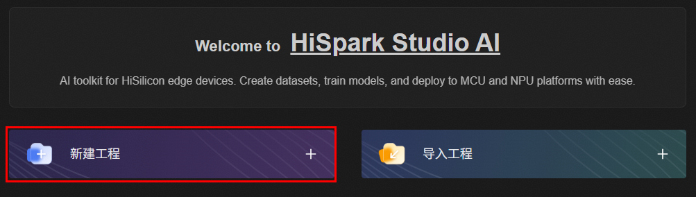
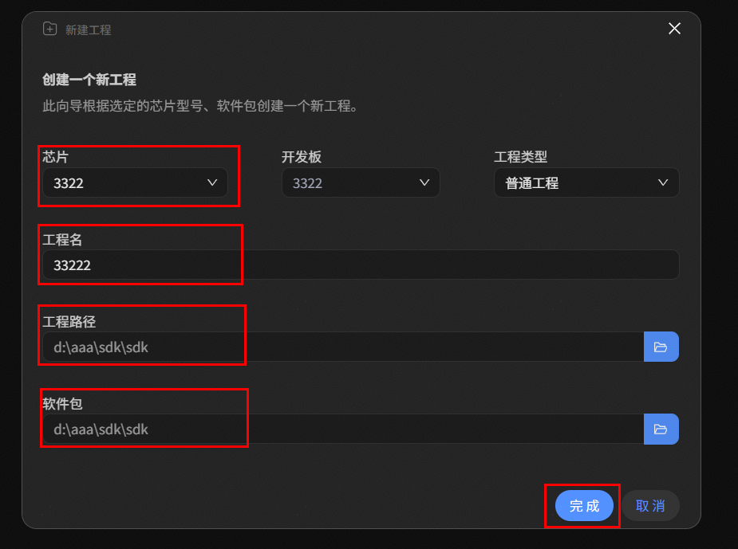
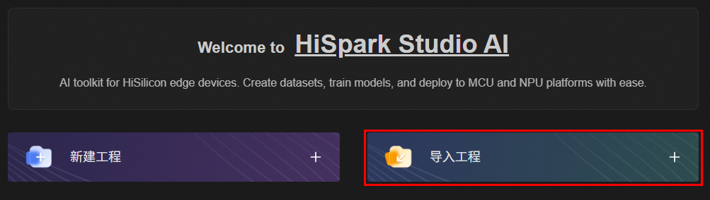
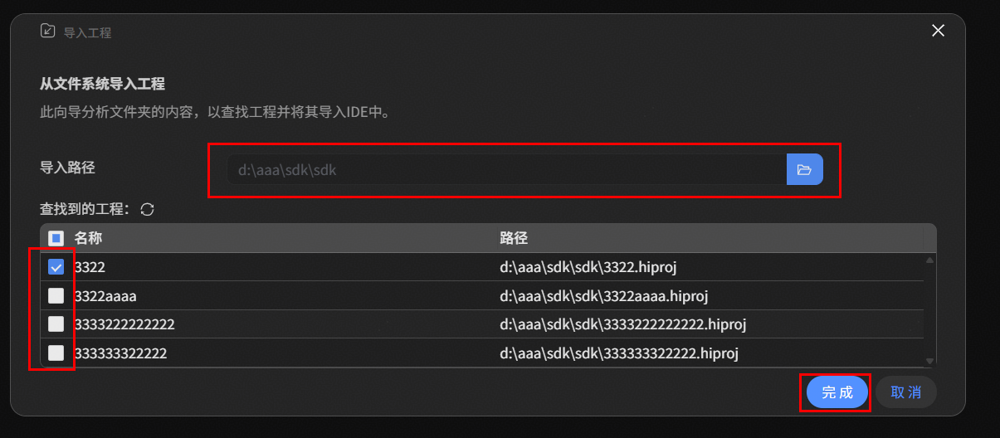

# 构建工程

1. 点击HiSpark Studio AI插件，点击"新建工程"
2. 选择芯片（本文以3322为样例）。输入工程名、工程路径。软件包路径选择与芯片对应的SDK包路径
3. 点击“完成"进入选择模型界面

<!--  -->

### 导入工程

- 已有工程的情况下也可直接导入工程
    1. 点击HiSpark Studio AI插件，点击"导入工程"
    2. 选择工程路径，选择工程
    3. 点击“完成"进入选择模型界面

