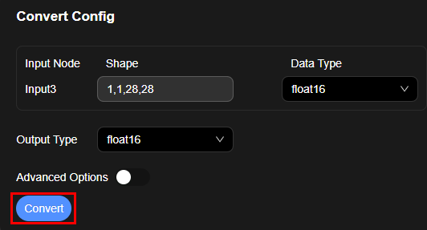
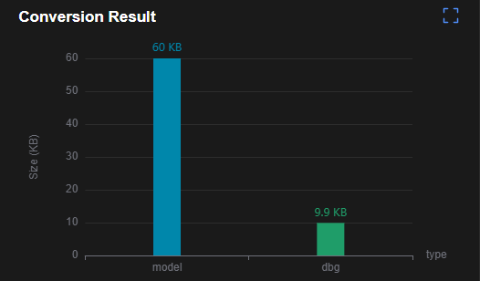
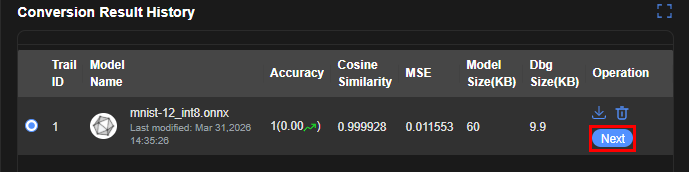
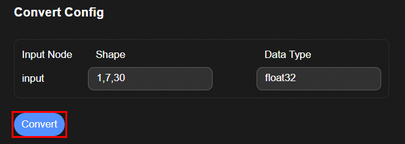
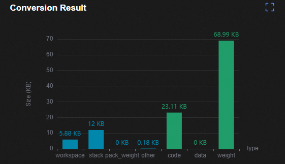
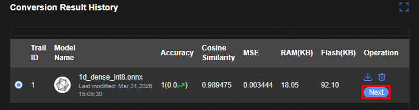

# 模型转换
## NPU
1. 在"Output Type"下拉框选择转换后网络的输出的目标数据类型

   

2. 点击"Convert"按钮进行转换，成功后在"Conversion Result History"显示转换后的结果；在Conversion Result图表中显示转换后模型的文件大小
    + MODEL SIZE: 网络模型大小
    + DBG SIZE: 网络调试信息文件大小

    

3. 在下方"Conversion Result History"表格中选中当前或过去的一条转换记录，点击"Operation"列中的"Next"进入SDK编译界面

   

## CPU
1. 点击"Convert"按钮进行转换，成功后在"Conversion Result History"显示转换后的结果

   

2. 在Conversion Result图表中显示AI推理运行过程中的额外RAM内存资源以及FLASH内存资源消耗
    + RAM: 额外RAM内存资源
    + FLASH: 额外Flash内存资源消耗

    

3. 在下方"Conversion Result History"表格中选中当前或过去的一条转换记录，点击"Operation"列中的"Next"进入SDK编译界面

   
