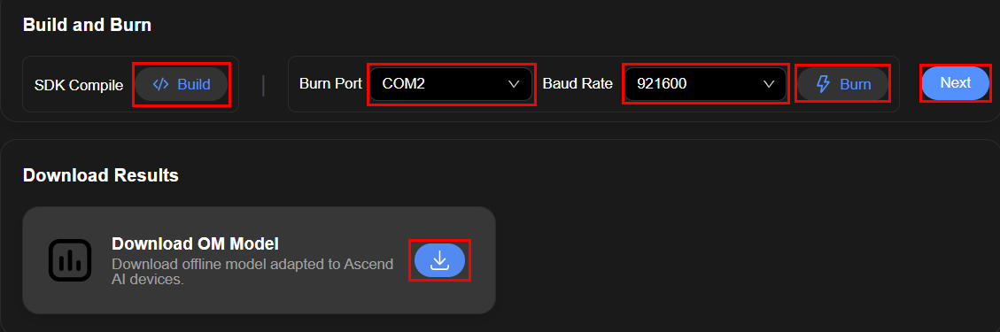
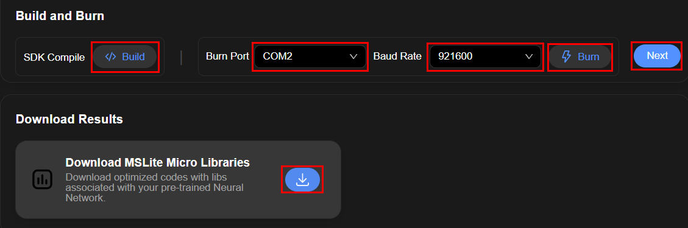

# SDK编译
1. 在转换页面生成结果后点击Next进入SDK编译页面
2. 点击"Build"按钮进行SDK编译
3. + NPU "Burn Port"选择烧录镜像的串口，选择波特率，点击"Burn"进行烧录
   + CPU "Port"选择传输数据的串口，选择波特率，点击"Burn"进行烧录
4. 点击下载按钮下载结果
5. 点击"Next"进入Benchmark界面
## NPU

## CPU
