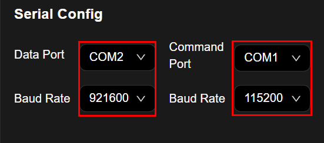
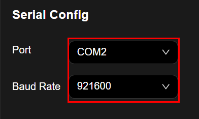
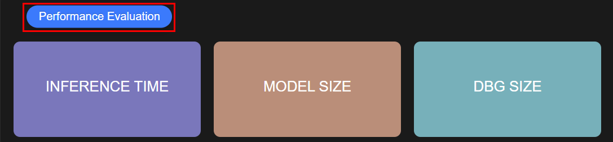
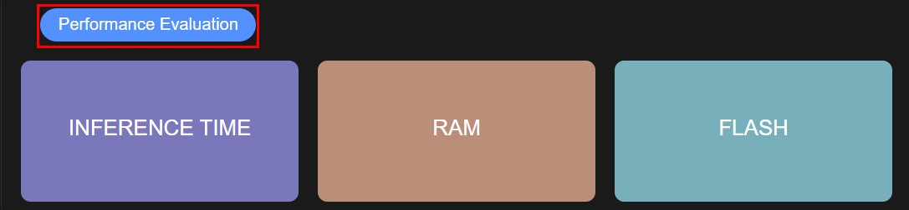
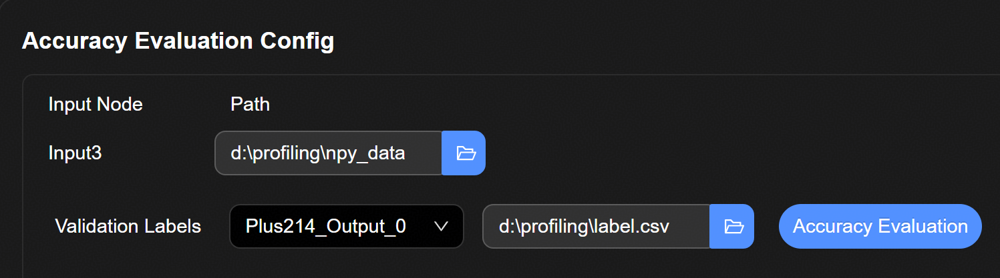
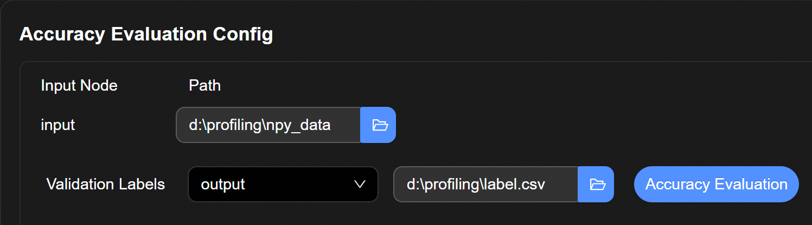
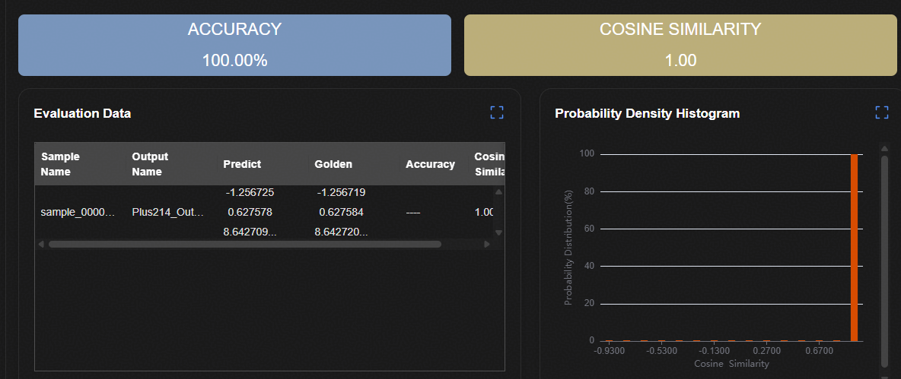

# Benchmark
## 串口配置
- NPU
1. 准备3322单板，并连接好串口，在界面中进行串口配置
2. "Data Port"选择传输数据的串口，"Baud Rate"选择921600
3. "Command Port"选择下发命令和烧录镜像的串口，"Baud Rate"选择115200

- CPU
1. 准备WS63单板，并连接好串口，在界面中进行串口配置
2. "Port"选择传输数据的串口；"Baud Rate"选择921600

## 性能评估
 点击性能验证按钮触发连板性能评估；评估结束后在界面中显示评估结果，如下图所示
- NPU
1. INFERENCE TIME: 网络模型推理时间
2. MODEL SIZE: 网络模型大小
3. DBG SIZE: 网络调试信息文件大小

- CPU
1. INFERENCE TIME: 网络模型推理时间
2. RAM: 执行过程中AI所占用RAM存储
3. FLASH: AI占用Flash存储大小

## 精度评估
1. 在"Input Node"栏内文件选择框中选择用于评估数据集目录：`包含.npy文件的文件夹`
2. 在"Validation Labels"下拉框选择所需的"Outputs"的"Name"，文件选择框中选择真值标签文件：`label.csv文件`
3. 点击精度验证触发连板精度评估；评估结束后在界面中显示评估结果，如下图所示
    + "ACCURACY"中展示的准确率
    + "COSINE SIMILARITY"中展示的余弦相似度
    + "Evaluation Data"中展示的各个测试样本的测试结果，包括：板端网络推理结果，原始网络推理结果结果，真值标签，余弦相似度
    + "Probability Density Histogram"中展示测试样本余弦相似度的分布直方图

## NPU

## CPU

## 结果展示

