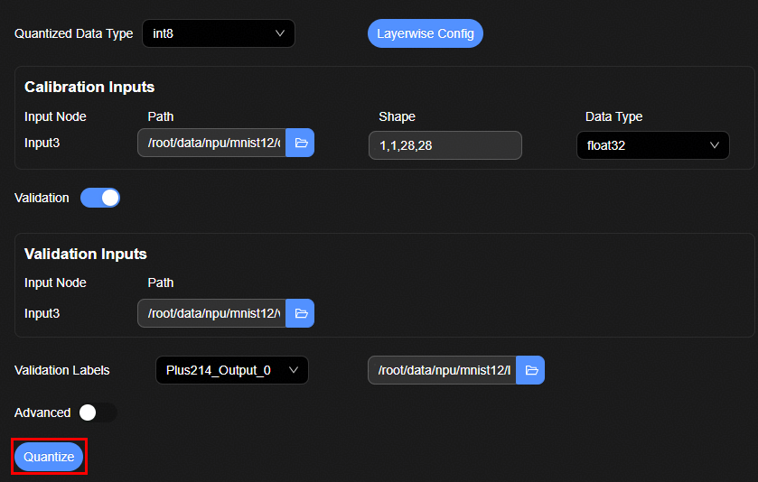
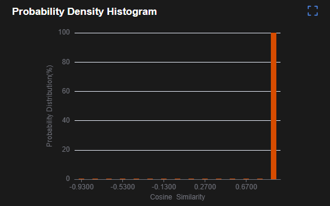
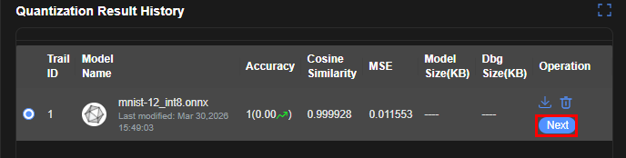
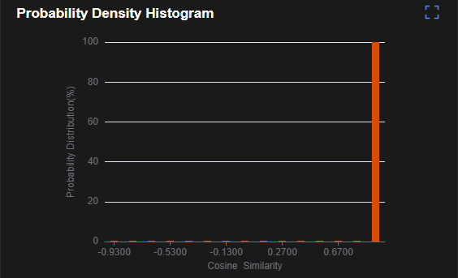
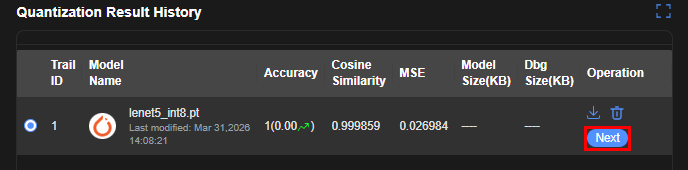
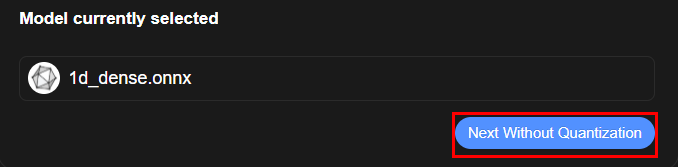
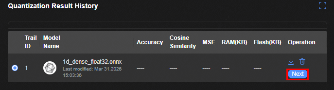
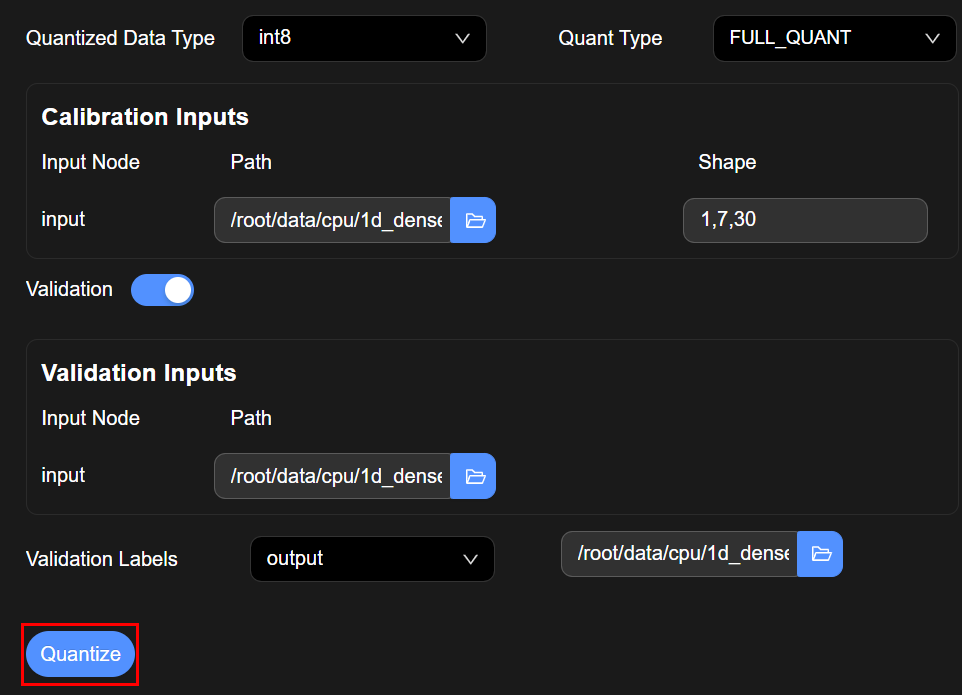
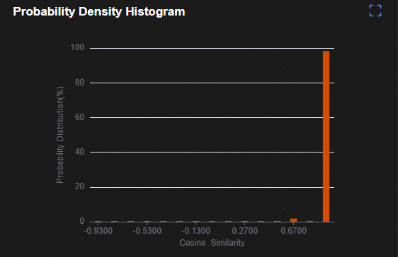
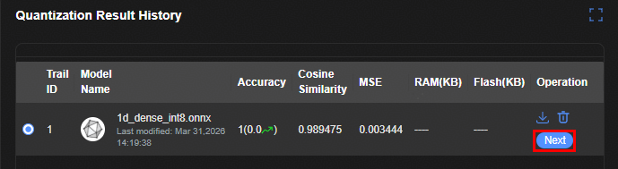

# 模型量化
## 训练后量化PTQ
1. 参考[文档](https://gitcode.com/HiSpark/hispark_ai/blob/master/src/samples/oh/lenet5/README.md)下载并预处理MNIST数据集；生成数据目录`train_data/npy`和`test_data/npy`；其中每个文件中存放的是一组数据。
2. "Quantized Data Type"下拉框选择模型量化的目标类型：int8
3. "Path"文件选择框中选择输入节点对应的校准数据集目录：`包含.npy文件的文件夹`
4. 打开"Validation"开关（可选）
5. "Validation Inputs"中的"Path"文件选择框中选择输入节点对应的验证数据集目录：`包含.npy文件的文件夹`
6. "Validation Labels"下拉框选择所需的"Outputs"的"Name", 并在文件选择框中选择验证数据集标签csv文件
7. 打开"Advanced"开关（可选）
8. "Ascend Config"文件选择框中选择配置好更多参数的cfg文件

   

9. 点击"Quantize"按钮进行量化，成功后在"Quantization Result History"列表中显示量化后的结果
    + "MSE"和"Cosine Similarity"分别指均方误差和平均余弦相似度，使用原始浮点网络与量化后网络计算的推理结果计算
    + "Accuracy"使用真值标签计算
    
    

10. 在下方"Quantization Result History"表格中选中当前或过去的一条量化记录，点击"Operation"列中的"Next"进入模型转换界面

   

## 量化感知训练QAT
1. 在"Network Structure"文件选择框中选择重训代码模板
2. 在"Input" 栏内 "Training Dataset"文件选择框中选择训练数据集：`包含.npy文件的文件夹`
3. 在"Input" 栏内 "Validation Dataset"文件选择框中选择验证集目录：`包含.npy文件的文件夹`
4. 在"Label" 栏内 "Training Dataset"文件选择框中选择训练集真值标签：`csv文件`
5. 在"Label" 栏内 "Validation Dataset"文件选择框中选择验证集真值标签：`csv文件`
6. 在"Epoch Num", "Batch Size", "Learning Rate"中分别输入所需值

   

7. 点击"Quantize"进行量化，成功后在"Quantization Result History"列表中显示量化后的结果
    + "MSE"和"Cosine Similarity"分别指均方误差和平均余弦相似度，使用原始浮点网络与量化后网络计算的推理结果计算
    + "Accuracy"使用真值标签计算
    
    

8. 在下方"Quantization Result History"表格中选中当前或过去的一条量化记录，点击"Operation"列中的"Next"进入模型转换界面
   
   

## CPU量化 
### 跳过量化
1. 点击"Next Without Quantization"，执行跳过量化的处理逻辑
   
   

2. 下方"Quantization Result History" 中仍然会出现一条量化记录，页面自动跳转到后续转换

   
   

### 量化
1. "Quantized Data Type"下拉框选择模型量化的目标类型：int8
2. "Quant Type"选择"FULL_QUANT"
3. 在"Calibration Inputs"文件选择框中选择训练数据集：`包含.npy文件的文件夹`
4. 打开"Validation"开关（可选）
5. 在"Validation Inputs"文件选择框中选择验证集目录：`包含.npy文件的文件夹`
6. "Validation Labels"下拉框选择所需的"Outputs"的"Name", 并在文件选择框中选择验证数据集的标签csv文件

   

7. 点击"Quantize"进行量化，成功后在"Quantization Result History"列表中显示量化后的结果
    + "MSE"和"Cosine Similarity"分别指均方误差和平均余弦相似度，使用原始浮点网络与量化后网络计算的推理结果计算
    + "Accuracy"使用真值标签计算
    
    

8. 在下方"Quantization Result History"表格中选中当前或过去的一条量化记录，点击"Operation"列中的"Next"进入模型转换界面

   