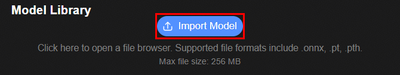
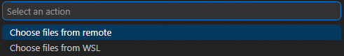
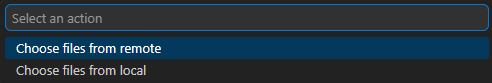
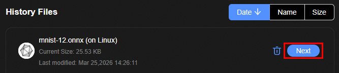

# 模型导入
1. 下载[mnist-12.onnx模型](https://gitcode.com/HiSpark/hispark_ai/blob/master/src/samples/oh/lenet5/model/mnist-12.onnx)或[lenet5.pt模型](https://gitcode.com/HiSpark/hispark_ai/blob/master/src/samples/oh/lenet5/model/lenet5.pt)

2. 点击"Import Model"按钮
   + NPU平台上，弹出框中出现 Choose files from remote 与 Choose files from WSL 两个选项，分别对应Linux通路与WSL通路。
   + CPU平台上，弹出框中出现 Choose files from remote 与 Choose files from local 两个选项，分别对应Linux通路与Windows本地通路
   
   

3. 选择相应平台上所需运行的通路。
   + 若选择Linux通路，选择"Choose files from remote"，随后设置远端连接：选择"仅命令传输&特定文件下载连接"，填入服务器地址，端口选择Docker容器对应的端口
   + 若选择WSL通路，选择 "Choose files from WSL"，随后选择WSL的发行版，可选择默认发行版，或自行指定发行版
   
   
   
   + 若选择Windows通路，选择 "Choose files from local"
   
   

3. 成功连接Linux服务器，或成功启用WSL后，选择待导入的模型文件；当前NPU平台支持.onnx、.pt、.pth格式的模型，CPU平台支持.onnx、.tflite格式的模型。
   + 若为Linux通路，则从远端服务器选择模型；若为WSL通路或Windows通路，则从本地选择模型
   + NPU平台进行训练后量化PTQ，请选择onnx模型：mnist-12.onnx
   + NPU平台进行量化感知训练QAT，请选择pt/pth模型：lenet5.pt
   + CPU平台请选择onnx/tflite模型：mnist-12.onnx
4. 在"History Files"找到导入的模型，点击"Next"进入模型量化界面
   
   

